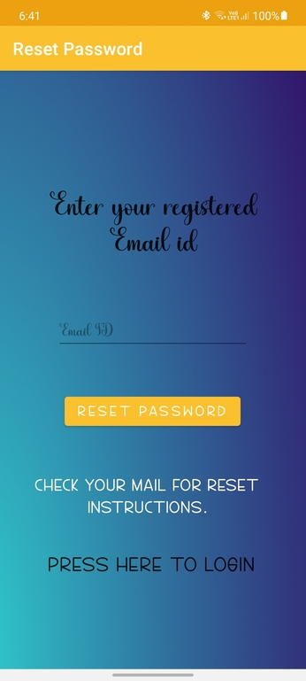

# Simple_Login_App_With_Firebase

Features:
Create account,
Email verification for new accounts,
Sign in to account,
Log out of account,
Reset password,

Using Firebase:
Google firebase is very good service provider in terms of data validation, data store, realtime data, push notification. We have only used google firebase email and google for sign in feature. We can do more out of it.

Register UI:

Login UI:

Reset UI:

